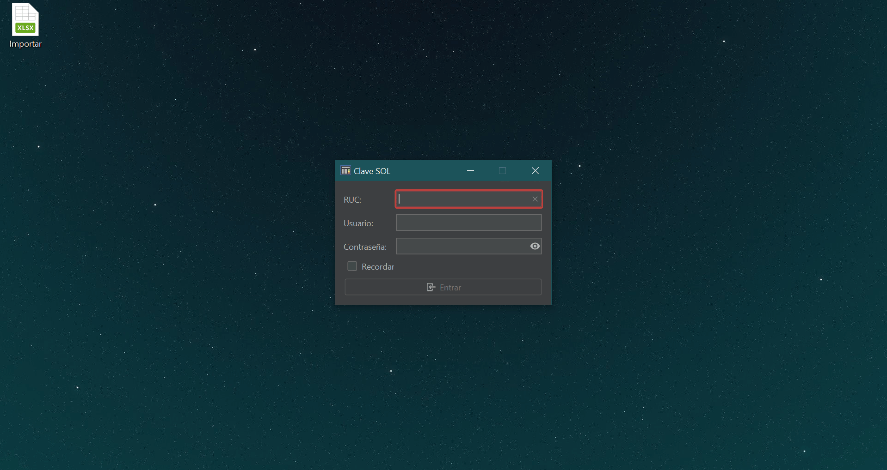
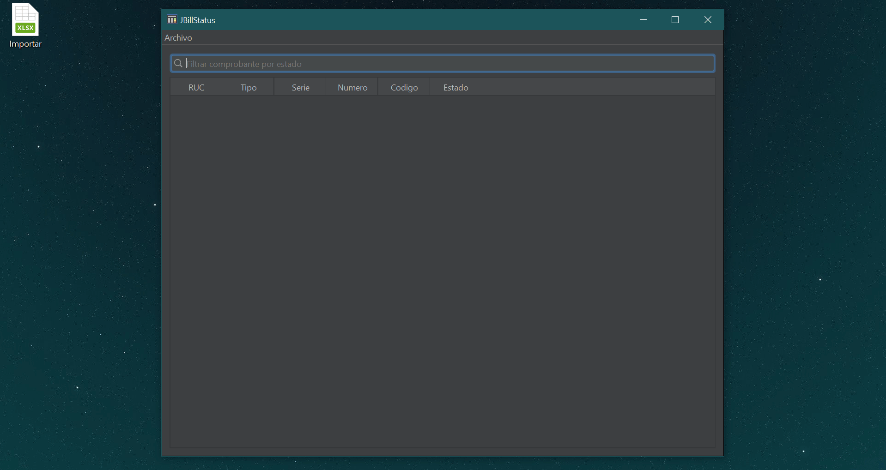
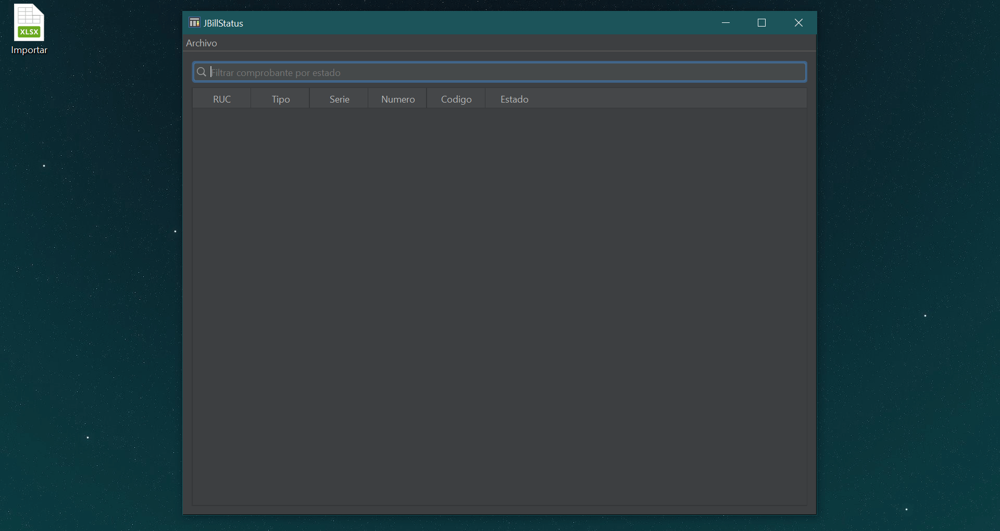

# JBillStatus | Consulta de comprobantes

## Descripción

Consulta masiva del estado de facturas, notas de crédito y debito que empiecen con la letra "F" y obtención de el archivo zip que contiene el CDR de aceptación o rechazo. Además de exportación de la información consultada a Excel.

## Pre-requisitos

- Clave SOL
- OpenJDK 11

## Uso

1. Ingrese con su Clave SOL. Puede darle en recordar para para no tener que ingresar el RUC y Usuario la próxima vez que abra el programa. **Este programa no almacena la contraseña.**

2. Prepare un archivo Excel con la siguiente estructura.

| RUC        | Tipo | Serie | Numero |
| ---------- | ---- | ----- | ------ |
| 1045529725 | 01   | F001  | 1      |

**RUC** del emisor del comprobante.

**Tipo** es el código de tipo de documento según el Anexo N° 8: Catálogo de códigos. Puede tomar los valores 01 para facturas, 07 para notas de crédito y 08 para botas de débito.

**Serie** del comprobante  a consultar.

**Numero** del comprobante a consultar.

3. Puede empezar la consulta dando clic en **Archivo → Importar** y seleccionando el archivo Excel, o puede arrastrarlo hacia la tabla. Una vez que el archivo sea importado espere a que el porcentaje de la barra llegue a 100, el tiempo depende de la cantidad de comprobantes a consultar.  

4. Puede filtrar los comprobantes consultados por **Código** o **Descripción**.

El campo estado puede tomar uno de los siguiente valores:

| TIPO  | CODIGO DE RETORNO | DESCRIPCION DE RETORNO                                       |
| ----- | ----------------- | ------------------------------------------------------------ |
| EXITO | 0001              | El comprobante existe y está aceptado.                       |
| EXITO | 0002              | El comprobante existe pero está rechazado.                   |
| EXITO | 0003              | El comprobante existe pero está de baja.                     |
| ERROR | 0004              | Formato de RUC no es válido (debe de contener 11 caracteres numéricos). |
| ERROR | 0005              | Formato del tipo de comprobante no es válido (debe de contener 2 caracteres). |
| ERROR | 0006              | Formato de serie inválido (debe de contener 4 caracteres).   |
| ERROR | 0007              | El numero de comprobante debe de ser mayor que cero.         |
| ERROR | 0008              | El número de RUC no está inscrito en los registros de la SUNAT. |
| ERROR | 0009              | EL tipo de comprobante debe de ser (01, 07 o 08).            |
| ERROR | 0010              | Sólo se puede consultar facturas, notas de crédito y debito electrónicas, cuya serie empieza con "F" |
| ERROR | 0011              | El comprobante de pago electrónico no existe.                |
| ERROR | 0012              | El comprobante de pago electrónico no le pertenece.          |

5. Puede obtener el CDR de aceptación o rechazo haciendo doble clic sobre un comprobante con estado 0001, 0002 o 0003 y luego elija la ubicación para guardar el archivo zip con el archivo xml. 

6. Puede exportar a Excel haciendo clic en **Archivo → Exportar** y eligiendo la ruta para guardar el archivo.

## Licencia

Este proyecto está bajo la Licencia Apache License Version 2.0 - mira el archivo [LICENSE.md](https://github.com/nthny/JBillStatus/blob/master/LICENSE) para detalles

